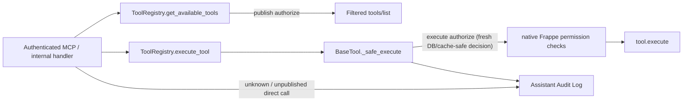

# Защищённый FAC для АИС: архитектурная спецификация

## 1. Решение и границы этапа

Этот этап создаёт защищённый fork Frappe Assistant Core (FAC) с единым шлюзом авторизации инструментов. Политика работает по принципу **default-deny**: неизвестное, ненастроенное, ошибочное или устаревшее состояние означает отказ.

Этап не меняет боевую Frappe, роли, ключи, OAuth/MCP-настройки и реальные данные. Он заканчивается кодом, тестами и инструкцией развёртывания; применение к production требует отдельного решения Алхаса, проверенного бэкапа и rollback rehearsal.

В текущем этапе:

- `delete_document` запрещён неизменяемой политикой. Разрешение удаления возможно только отдельным изменением после технически проверенного backup/restore и определения исполнимого plan-gate; социального обещания «работать по плану» недостаточно для программного разрешения.
- `run_python_code`, `run_database_query`, `analyze_business_data`, `extract_file_content` запрещены неизменяемой политикой.
- все три visualization-инструмента изолированы и запрещены до отдельного аудита их create/share/read путей;
- внешние инструменты из `assistant_tools` запрещены; одного включения `custom_tools` или записи в FAC Tool Configuration недостаточно;
- AIS Builder не реализуется и не разрешается. Его будущий контракт требует отдельного документа с allowlist целевых DocType, типов Custom Field и свойств Property Setter. До этого системная кастомизация закрыта.

Статус `approved` этим документом не устанавливается.

## 2. Подтверждённые дефекты upstream 2.5.0

| Дефект | Фактический путь | Последствие |
|---|---|---|
| Нет конфигурации = разрешено | `core/tool_registry.py::_is_tool_enabled`, `_check_role_access` | новый или неизвестный tool открыт автоматически |
| `Allow All` = разрешено всем | `core/tool_registry.py`, `FAC Tool Configuration` | конфигурация не является allowlist |
| System Manager обходит role gate | `core/tool_registry.py::_check_role_access` | god-mode Frappe расширяет MCP-возможности |
| MCP исполняет сохранённую функцию напрямую | `api/fac_endpoint.py::_build_tool_registry` → `mcp/tool_adapter.py` → `mcp/server.py::_handle_tools_call` | нет свежей call-time проверки |
| Отказ до `_safe_execute` не аудируется | registry и MCP unknown/hidden paths | неполный Assistant Audit Log |
| Миграция включает всё | `utils/migration_hooks.py::_sync_plugin_configurations`, `_sync_tool_configurations` | fresh install и новые tools/plugins получают enabled/Allow All |
| Мёртвая матрица использует старые имена | `core/security_config.py::ROLE_TOOL_ACCESS`; вызовов `check_tool_access` нет | документация создаёт ложное чувство защиты |
| Удаление обходит FAC document policy | `plugins/core/tools/delete_document.py` | restricted DocType и `force=True` не закрыты центрально |
| Аналитика/файлы обходят row permissions | `analyze_business_data.py`, `extract_file_content.py`, `code_execution_subprocess.py` используют `frappe.get_all` | возможна утечка недоступных записей |
| Search/report/metadata имеют локальные обходы | `metadata_tools.py`, `report_tools.py` используют `frappe.get_all`; metadata раскрывает child schema | непоследовательная защита DocType и строк |
| Legacy registry небезопасен | `assistant_core/tools.py` использует `frappe.get_all` и не применяет новую конфигурацию | потенциальный обход при повторном подключении legacy path |

## 3. Инвентарь зарегистрированных инструментов

Источник истины — runtime source discovery built-in plugins: `PluginDiscovery.discover_plugins()` перечисляет модули core/data_science/visualization, после чего их `BaseTool` classes импортируются без зависимости от enabled-state и dependency validation. Контрактный snapshot содержит 24 имени ниже и в тесте сравнивается с фактически обнаруженным набором; `plugin_manager.get_all_tools()` для этого не подходит, потому что возвращает только tools включённых plugins. Handwritten snapshot не подменяет discovery. `migrate_visualization` из `plugins/visualization/plugin_registry.py` является методом неиспользуемого `BasePlugin`, не зарегистрирован как tool и в инвентарь не входит.

| Класс | Точные tool names | Политика этого этапа |
|---|---|---|
| Core read | `get_document`, `list_documents`, `search_documents`, `search_doctype`, `search_link`, `search`, `fetch`, `get_doctype_info`, `report_list`, `report_requirements`, `generate_report`, `get_pending_approvals` | можно явно включить для конкретных ролей после прохождения central + native Frappe checks |
| Core write | `create_document`, `update_document`, `submit_document`, `run_workflow` | можно явно включить; обязательны operation/DocType/document/field checks |
| Core destructive | `delete_document` | hard deny |
| Data science | `run_python_code`, `run_database_query`, `analyze_business_data`, `extract_file_content` | hard deny |
| Visualization | `create_dashboard`, `create_dashboard_chart`, `list_user_dashboards` | hard deny на этом этапе |
| External hooks | произвольные имена из `assistant_tools` | hard deny на этом этапе |

Имена из старой матрицы (`document_get`, `execute_python_code`, `query_and_analyze`, `report_execute` и другие) не используются как разрешения. Известные опасные legacy aliases заносятся только в deny-set, чтобы случайное повторное подключение не открыло их.

## 4. Единая политика

Добавляется `core/security_policy.py` с одним публичным контрактом:

```python
decision = SecurityPolicy.authorize(
    actor=frappe.session.user,
    tool_name=tool.name,
    arguments=arguments,
    phase="publish" | "execute",
)
```

`PolicyDecision` содержит `allowed`, `reason_code`, `operation`, `target_doctype`, `target_name` и безопасные audit details. Авторизация не возвращает чувствительные данные и не меняет состояние.

Порядок решения, без исключений для System Manager/Administrator:

1. actor аутентифицирован, не `Guest`, `assistant_enabled=1`;
2. tool входит в зарегистрированный inventory;
3. tool не входит в immutable hard-deny set;
4. plugin явно enabled; отсутствие записи означает disabled;
5. FAC Tool Configuration существует, `enabled=1`, mode = `Restrict to Listed Roles`;
6. хотя бы одна явно разрешённая роль совпадает; `Allow All`, пустой список, неизвестный mode или ошибка чтения означают deny;
7. для внешнего tool требуется code-level trusted allowlist; в этом этапе он пуст;
8. аргументы преобразованы в operation context по декларативной карте;
9. target DocType не входит в immutable restricted set;
10. поля ввода не входят в immutable sensitive/admin set, включая вложенные child rows;
11. нативные Frappe DocType- и document-level permissions разрешают действие;
12. tool-specific invariant выполнен.

Настройки FAC могут только сужать кодовую базовую политику. Они не могут включить hard-denied tool, restricted DocType, запрещённое поле или System Manager bypass.

### 4.1 Операционный контекст

| Tool | Operation/context |
|---|---|
| `create_document` | `create`, `doctype`, `data`; `submit=true` требует также `submit` |
| `get_document`, `fetch` | `read`, `doctype/name`; для `fetch` безопасно разбирается `id` |
| `update_document` | `write`, `doctype/name/data` |
| `list_documents`, `search_doctype`, `search_link` | `read`, `doctype`, fields/filters |
| `search_documents`, `search` | `read_many`; каждый кандидирующий DocType и результат фильтруется политикой |
| `get_doctype_info` | `metadata_read`, `doctype`; child metadata проверяется отдельно |
| `report_list` | `report_discover`; результаты permission-aware |
| `report_requirements`, `generate_report` | `report_read`, `report_name`; проверяется Report и его `ref_doctype` |
| `get_pending_approvals` | `workflow_read`; каждый reference document требует `read` |
| `submit_document` | `submit`, `doctype/name` |
| `run_workflow` | `workflow_write`, `doctype/name/action`; Frappe transitions остаются вторым замком |

Hard-denied tools получают решение до разбора пользовательского кода, SQL, file URL или visualization payload.

### 4.2 Restricted DocTypes и поля

Авторитетная неизменяемая константа `RESTRICTED_DOCTYPES` этого этапа содержит ровно следующий ratified baseline:

```python
RESTRICTED_DOCTYPES = frozenset({
    "User", "Role", "User Permission", "Role Permission", "Custom Role",
    "Module Profile", "Role Profile", "Custom DocPerm", "DocShare",
    "System Settings", "Print Settings", "Email Domain", "LDAP Settings",
    "OAuth Settings", "Social Login Key", "Dropbox Settings", "Connected App",
    "OAuth Bearer Token", "OAuth Client", "Error Log", "Activity Log",
    "Access Log", "View Log", "Scheduler Log", "Integration Request",
    "Server Script", "Client Script", "Custom Script", "Property Setter",
    "Customize Form", "Customize Form Field", "DocType", "DocField",
    "DocPerm", "Custom Field", "Package", "Package Release",
    "Installed Application", "Data Import", "Data Export", "Bulk Update",
    "Rename Tool", "Database Storage Usage By Tables", "Workflow",
    "Workflow Action", "Workflow State", "Workflow Transition", "Email Queue",
    "Email Queue Recipient", "Email Alert", "Auto Email Report", "File",
    "Assistant Core Settings", "FAC Tool Configuration", "FAC Tool Role Access",
    "FAC Plugin Configuration", "Assistant Audit Log",
})
```

Кроме списка выше, любой DocType с `meta.istable == 1` запрещён как прямой MCP target; child rows допустимы только внутри разрешённого parent document и проходят рекурсивную проверку полей. Уменьшение этого baseline требует нового review; расширение допускается только с тестом, фиксирующим причину.

Список чувствительных полей — объединение существующего `SENSITIVE_FIELDS` и универсальных вариантов `token`, `password`, `secret`, `authorization`, `cookie`, `cookies`, `session`, `api_key`, `api_secret`, `encryption_key` с нормализацией регистра и разделителей. Он применяется рекурсивно к input и output без bypass для System Manager. Центральный `SecurityPolicy.redact_output(context, value)` вызывается для результата каждого tool до ответа клиенту и до audit sink; локальные фильтры tools могут только дополнительно скрывать данные.

## 5. Точки принудительного применения



Изменения маршрутизации:

- `mcp/tool_adapter.build_tool_dict` получает executor и вызывает `ToolRegistry.execute_tool`, а не `tool_instance._safe_execute` напрямую;
- `fac_endpoint._build_tool_registry` передаёт registry executor в adapter;
- `ToolRegistry.execute_tool` разрешает экземпляр, но окончательное решение выполняется внутри `_safe_execute` непосредственно перед tool code;
- `ToolRegistry.execute_tool` не выполняет прежние `_is_tool_enabled`/`_check_role_access` prechecks и не выбрасывает отказ до `_safe_execute`; единственный policy gate известного tool находится в `_safe_execute`, чтобы каждый отказ имел ровно одну audit row;
- `BaseTool._safe_execute` всегда вызывает `SecurityPolicy.authorize(..., phase="execute")`, поэтому прямой вызов `_safe_execute` внешним кодом также закрыт;
- `api/handlers/tools.py` продолжает использовать `ToolRegistry.execute_tool`;
- неизвестный/неопубликованный tool в `mcp/server.py` журналируется как отказ;
- `assistant_core/tools.py` помечается внутренним deprecated path и делегирует canonical registry либо становится неисполняемым. Небезопасные реализации не остаются запасным API;
- `tools/list` использует `phase="publish"` и может применять 60-секундный cache только как фильтр публикации. `phase="execute"` всегда читает plugin/tool configuration из БД без этого cache. Список не является authority: execute всегда принимает новое решение;
- `_handle_tools_call` проверяет, что `arguments` является JSON object/dict, и отклоняет иной top-level shape до executor;
- неизвестное имя и любое необработанное исключение MCP возвращают только стабильное `Tool is not available`/`Tool execution failed`; traceback и доступный inventory клиенту не передаются.

Ошибки policy, cache, DocType extraction и permission lookup закрываются отказом. Отказ не включает список доступных инструментов в ответ атакующему.

## 6. Аудит

Каждая попытка `tools/call` создаёт ровно одну запись Assistant Audit Log:

- разрешённый вызов: `Success`, `Error` или `Timeout`;
- hard deny, disabled, role mismatch, restricted target, forbidden field, native permission failure: `Permission Denied` с стабильным `reason_code`;
- unknown/unpublished name: `Permission Denied` до поиска функции;
- ошибка policy: `Permission Denied`, reason `POLICY_ERROR_FAIL_CLOSED`.

`tools/list` не создаёт по строке на каждый скрытый tool. Создаётся одна summary security event с actor, количеством опубликованных/скрытых tools и без пользовательских аргументов.

Audit sink рекурсивно санирует `Mapping`, list, tuple и set; ключи `token`, `password`, `secret`, `authorization`, cookies, API credentials и их варианты редактируются на любой глубине. JSON-looking object/array strings размером до 64 KiB безопасно разбираются, рекурсивно санируются и сериализуются обратно; произвольные или большие строки не парсятся. Санитайзер применяется к arguments, output, error и traceback непосредственно в sink. Target и operation берутся только из проверенного `PolicyDecision.context`, а не из сырых top-level arguments.

Ответ об отказе и audit row не содержат исходный code, SQL, API secret или содержимое файла. `BaseTool` и MCP logging не передают raw arguments в `frappe.log_error` или debug log: там остаются только tool name, reason code, проверенный context и correlation id. Для разрешённых mutations сохраняются target, operation и безопасные before/after hashes; полные документы в журнал не копируются. Builder before/after не применим, так как Builder закрыт.

Отказы аутентификации MCP журналируются как security event для `Guest`/неопределённого actor без значения Authorization header.

## 7. Безопасная миграция Allow All

Добавляется идемпотентный patch и меняются install/migrate sync defaults.

### Существующие строки

1. hard-denied tool или legacy alias → `enabled=0`, mode `Deny All`, role rows очищаются;
2. `Allow All`, пустой/неизвестный mode или пустой restricted list → `enabled=0`, mode `Deny All`;
3. корректный `Restrict to Listed Roles` сохраняется только для не hard-denied tool;
4. plugin configuration не может сама открыть tools; для не-core plugin без доказанного назначения безопасный migration default — disabled;
5. миграция пишет только агрегированные counts в лог и не назначает роли автоматически;
6. строки обновляются через `frappe.db.set_value` по точным полям `enabled` и `role_access_mode`, а child role rows удаляются через `frappe.db.delete`; это исключает зависимость patch от controller/schema validation во время перехода. Raw SQL не используется. Registry cache очищается один раз после batch;
7. `_sync_tool_configurations` никогда автоматически не удаляет конфигурацию отсутствующего tool: disabled plugin может временно исключить tool из discovery, и его deny/restricted config должен сохраниться. Повторное включение plugin не создаёт permissive запись.

### Новые строки и fresh install

- FAC Tool Configuration: `enabled=0`, mode `Deny All`;
- новый plugin: disabled, кроме технически обязательного core plugin; core tools всё равно disabled до явной конфигурации;
- external tools: disabled + `Deny All` и runtime hard deny;
- повторный `bench migrate` не возвращает `Allow All` и не перезаписывает явный restricted allowlist.

В DocType добавляется mode `Deny All`; UI/API больше не предлагают `Allow All`. Если старое значение всё же попало в runtime до patch, policy трактует его как deny.

Миграционный patch разрабатывается и тестируется в fork, но запускается на production только после отдельного одобрения, backup verification и снятия конфигурационного snapshot.

## 8. Tool-specific corrections до разрешения

- `search_documents`/`search`: удалить `User` и `DocType` из безусловного списка; каждый DocType проходит policy, запросы остаются `get_list(ignore_permissions=False)`.
- `search_doctype`, `search_link`, `list_documents`: central target check + native row permission.
- `get_doctype_info`: не выдавать restricted schema; child DocType metadata проверять отдельно; не принимать произвольный `user` для просмотра чужих permission capabilities.
- `report_tools`: заменить suggestion/list `get_all` на permission-aware lookup; проверять `Report` и `ref_doctype`; не отдавать отчёты по restricted targets.
- `get_pending_approvals`: проверять read permission каждого reference document и отбрасывать недоступные записи.
- `create_document`, `update_document`, `submit_document`, `run_workflow`: central input field/target checks перед загрузкой/изменением документа; Frappe create/write/submit/workflow остаются обязательными.
- `delete_document`: не исполняется независимо от config; `force` недостижим.
- data-science, file, visualization: не исполняются; исправление их внутренних функций не является условием безопасного core bridge этого этапа.
- legacy registry: не исполняет собственные CRUD/search реализации.

## 9. Проверка

### Unit/contract tests

- все 24 фактических tool names классифицированы; неизвестное имя получает deny;
- missing config, `Allow All`, `Deny All`, пустые roles, policy exception → deny;
- System Manager/Administrator не обходят hard deny, config, target или field policy;
- disabled tool не публикуется и не вызывается напрямую;
- изменение config между `tools/list` и `tools/call` блокирует call (TOCTOU test);
- MCP adapter вызывает registry executor, не raw `_safe_execute`;
- прямой `_safe_execute` также вызывает central policy;
- external hook остаётся запрещённым даже при включённом plugin/config;
- restricted DocType и nested sensitive fields блокируются;
- каждый denial path создаёт одну sanitized audit row;
- nested secrets отсутствуют в input/output/error/traceback audit payload;
- JSON-looking nested strings санируются в пределах 64 KiB, а MCP принимает только object arguments;
- output redaction действует на document/list/search/report/metadata/fetch для обычного пользователя и System Manager;
- реальные `.save()` и `frappe.db.set_value` изменения конфигурации между list/call блокируют execute без ожидания cache TTL;
- Error Log и MCP 401/error bodies не содержат raw secret или `str(exception)`;
- migration идемпотентна, не возвращает `Allow All`, не удаляет config disabled plugin и исправляет устаревший import `core.enhanced_tool_registry` в install/migration hook.

### Frappe integration tests

Минимум три пользователя: Assistant User, Assistant Admin, System Manager. Для каждого проверяются tools/list и tools/call, native row permissions, restricted DocTypes, create/update/submit/workflow, hard-denied names, unknown name, auth failure и audit rows. Отдельно проверяется параллельная изоляция request registry.

### Команды качества

- локальные pure/unit tests, доступные без site;
- `python -m compileall` с внешним pycache;
- `git diff --check`;
- в Frappe bench/site: целевые FAC tests и затем полный набор app tests;
- lint/security checks, объявленные upstream project.

Успешный `compileall` без Frappe bench не считается достаточным. Если test site недоступен, статус реализации остаётся `verification-blocked`, а не `complete`.

## 10. Rollout и rollback

Перед production:

1. зафиксировать installed apps/version, FAC configs, plugin configs, roles и MCP clients;
2. создать и проверить восстановимость DB + private/public files backup;
3. прогнать migration на staging-копии;
4. вручную сформировать минимальные role allowlists для конкретных agent users;
5. smoke-test `tools/list`, разрешённый read и все negative paths;
6. только затем переключить bridge.

Rollback: отключить FAC endpoint/plugin, вернуть предыдущий app revision и DB/config snapshot, проверить старый `frappe_api.sh`. Откат приложения без отката мигрированных конфигураций не считается полным rollback.

## 11. Критерий готовности архитектуры

После одобрения этого документа реализация не требует продуктовых решений: secure core bridge полностью fail-closed; delete/data-science/files/visualization/external/Builder остаются закрыты. Их включение — отдельные будущие изменения с собственным design gate.

Следующий артефакт после одобрения — подробный TDD implementation plan с точными файлами, тестами и малыми коммитами.
